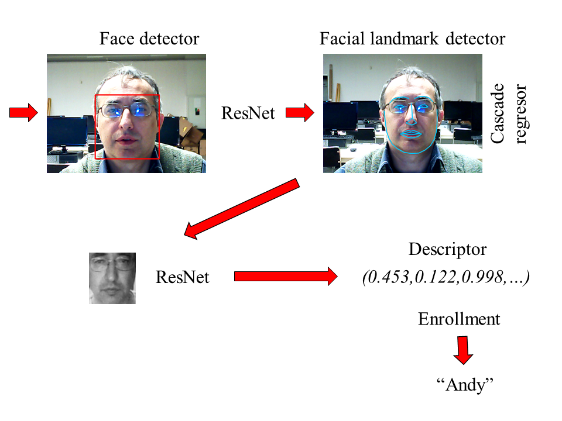

# DeepFaceRecognizer
An example of employment of deep learning for face recognition

This project was created by Andrej Lucny for course LearnOpenCV led by Satya Mallick in 2018

The goal is to manage face recognition in an interactive way.
The system is learning new people introduced by language communication on console. 
When it sees somebody new, it can be wrong, however after the person is introduced, 
the system solves any misrecognition by storing next descriptor associated with the 
person. After some time, the system collects several images for person and this process 
saturates. Introduction ends when person is out of frame for more than three seconds, 
what can be emulated also by covering of camera. Then system recognize the additional person. 
See this video: 

The project employs Kazemi's Face landmark detector from Dlib,
and two resent models (one for face detection from OpenCV and 
other for image descriptor calculation from Dlib)

[]

How to install:

The project refers environmental variables:

CUDA_PATH_V9_2=C:\Program Files\NVIDIA GPU Computing Toolkit\CUDA\v9.2
OPENCV_DIR=c:\faces\opencv-3.4.1
DLIB_DIR=c:\faces\dlib-19.13

C:\>dir /B %OPENCV_DIR%
bin
etc
include
LICENSE
OpenCVConfig-version.cmake
OpenCVConfig.cmake
x64

C:\>dir /B %OPENCV_DIR%\x64\vc15\lib
OpenCVConfig-version.cmake
OpenCVConfig.cmake
OpenCVModules-release.cmake
OpenCVModules.cmake
opencv_aruco341.lib
opencv_bgsegm341.lib
opencv_bioinspired341.lib
opencv_calib3d341.lib
opencv_ccalib341.lib
opencv_core341.lib
opencv_cudaarithm341.lib
opencv_cudabgsegm341.lib
opencv_cudacodec341.lib
opencv_cudafeatures2d341.lib
opencv_cudafilters341.lib
opencv_cudaimgproc341.lib
opencv_cudalegacy341.lib
opencv_cudaobjdetect341.lib
opencv_cudaoptflow341.lib
opencv_cudastereo341.lib
opencv_cudawarping341.lib
opencv_cudev341.lib
opencv_datasets341.lib
opencv_dnn341.lib
opencv_dnn_objdetect341.lib
opencv_dpm341.lib
opencv_face341.lib
opencv_features2d341.lib
opencv_flann341.lib
opencv_fuzzy341.lib
opencv_hdf341.lib
opencv_hfs341.lib
opencv_highgui341.lib
opencv_imgcodecs341.lib
opencv_imgproc341.lib
opencv_img_hash341.lib
opencv_line_descriptor341.lib
opencv_ml341.lib
opencv_objdetect341.lib
opencv_optflow341.lib
opencv_phase_unwrapping341.lib
opencv_photo341.lib
opencv_plot341.lib
opencv_reg341.lib
opencv_rgbd341.lib
opencv_saliency341.lib
opencv_shape341.lib
opencv_stereo341.lib
opencv_stitching341.lib
opencv_structured_light341.lib
opencv_superres341.lib
opencv_surface_matching341.lib
opencv_text341.lib
opencv_tracking341.lib
opencv_video341.lib
opencv_videoio341.lib
opencv_videostab341.lib
opencv_xfeatures2d341.lib
opencv_ximgproc341.lib
opencv_xobjdetect341.lib
opencv_xphoto341.lib

C:\>dir /B %DLIB_DIR%
bin
data
include
lib
staticlib

C:\>dir /B %DLIB_DIR%\staticlib
dlib1913stat.lib
giflib416.lib

Having this stuff, just open DeepFaceRecognizer.sln in VS2017
or launch by run.bat (having dlls of opencv in PATH)

lucny@fmph.uniba.sk  www.agentspace.org/andy
